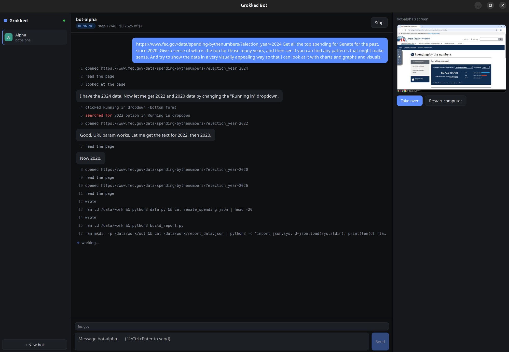

# Grokked Bot

**An open-source AI teammate that runs on your own Linux box.** Powered by
[OpenRouter](https://openrouter.ai), so you pick the model. Inspired by Grok Bot and
Claude Cowork — the difference is that the "computer" your agent works on is a container
on hardware you already own, not a cloud VM you rent.



You message a bot like a colleague. It has **its own computer** — a real desktop with a
real browser it stays logged into, plus a shell — and it uses whichever fits the job. You
watch it work on the right, and you can take the mouse away from it at any moment.

Above: asked for the top 10 spenders of 2024 on `fec.gov`, the bot opened the page, read
the table and answered in three steps for about five cents — and said which view it had
read, so you know what to ask for next. On the right is its live screen, with a human
holding control.

## On a Mac

**[Download for Apple Silicon](https://github.com/alnutile/grokked-bot/releases/latest/download/Grokked-Bot-mac-apple-silicon.dmg)** ·
[Intel](https://github.com/alnutile/grokked-bot/releases/latest/download/Grokked-Bot-mac-intel.dmg) ·
[All releases](https://github.com/alnutile/grokked-bot/releases)

Drag **Grokked Bot** to Applications and open it. The first launch is blocked because
the app isn't notarized yet: open **System Settings → Privacy & Security** and click
**Open Anyway**, once per version. The app then walks you through the rest:

1. **Docker.** Install [Docker Desktop](https://www.docker.com/products/docker-desktop/)
   (or OrbStack) and open it. It supplies the Linux VM each bot's computer runs in.
2. **The bot's computer.** A one-time ~5 GB download, started from the app.
3. **An OpenRouter key.** Pasted into the app, checked, and saved.

The app ships its own Node and runs the daemon itself. Two differences from Linux:
**bots stop when you quit the app**, and on Apple Silicon the bot's Chrome runs under
Rosetta, so it's a bit slower.

**Cutting a release:** `git tag v0.2.0 && git push origin v0.2.0`. The `release` workflow
stamps the version into the app, builds and smoke-tests both Macs, pushes the bot
computer image to `ghcr.io/alnutile/grokked-computer`, and opens a draft release with
`.github/release-notes.md` as its notes. Publish it from the Releases page. For a local
build on a Mac: `scripts/build-mac.sh`.

## Quick start (Linux)

Tested on Ubuntu with Node 24. Nothing below needs root except installing system packages.

### 1. Install the prerequisites

| | |
|---|---|
| **Node 24+** | Runs the TypeScript daemon directly, no build step. [nvm](https://github.com/nvm-sh/nvm) works fine. |
| **pnpm** | `corepack enable` (ships with Node) |
| **Rust** | [rustup.rs](https://rustup.rs) — for the Tauri desktop app |
| **Tauri's system libs** | `sudo apt install libwebkit2gtk-4.1-dev build-essential curl wget file libxdo-dev libssl-dev libayatana-appindicator3-dev librsvg2-dev` |
| **Rootless Docker** | [docs.docker.com/engine/security/rootless](https://docs.docker.com/engine/security/rootless/) |
| **An OpenRouter key** | [openrouter.ai/keys](https://openrouter.ai/keys), with a few dollars of credit |

Then set up rootless Docker and let your user services outlive your login:

```bash
dockerd-rootless-setuptool.sh install
systemctl --user enable --now docker.service
loginctl enable-linger "$USER"          # bots keep working after you log out
```

Prefer **rootless** Docker over adding yourself to the `docker` group: that group is
effectively root (`docker run -v /:/host`), a poor trade for a system whose job is holding
live credentials.

### 2. Get the code and build the bot's computer

```bash
git clone https://github.com/alnutile/grokked-bot.git
cd grokked-bot
pnpm install

export DOCKER_HOST=unix:///run/user/$(id -u)/docker.sock
docker build -t grokked/computer:0.1 container/     # ~5GB, takes a few minutes
```

### 3. Add your OpenRouter key

```bash
mkdir -p ~/.config/grokked
printf 'OPENROUTER_API_KEY=sk-or-...\n' > ~/.config/grokked/env
chmod 600 ~/.config/grokked/env
```

### 4. Install the daemon

The daemon is a `systemd --user` service. The unit file has placeholders for where Node
and this repo live; this fills them in:

```bash
mkdir -p ~/.config/systemd/user
sed -e "s|@NODE@|$(command -v node)|" -e "s|@REPO@|$PWD|g" \
  packages/daemon/deploy/grokked.service > ~/.config/systemd/user/grokked.service
systemctl --user daemon-reload
systemctl --user enable --now grokked.service

systemctl --user status grokked           # should say active (running)
```

If you upgrade Node later (nvm puts the version in the path), re-run the `sed` line.

### 5. Open the app

```bash
./run-app.sh
```

The first run compiles the Tauri app, which takes a few minutes. After that it opens in
seconds.

## Your first task

1. Click **+** at the top of the sidebar. The new bot opens on its **Details** tab: give it
   a name, say what it's for, add standing instructions, and list the sites it may visit
   (for example `linkedin.com`). That allowlist is enforced inside its computer, not just
   in the prompt. Each bot gets its own computer — its own container, browser profile and
   logins — created the first time it's needed.
2. Type what you want, the way you would to a colleague, and press **Ctrl+Enter**. The
   **+** in the message bar overrides the sites or the spending cap for one message.

The conversation shows each step as it happens, and the **Computer** tab shows its screen.
It's a real conversation: follow-ups like "now do the same for 2022" or "did that work?"
see what came before. Conversations get a title automatically (click it to rename), are
listed in the sidebar, and are still there after a restart. **New** starts a fresh one.
Anything the bot saves or downloads shows up in its **Media** tab.

If it hits something it can't do alone — a login wall, a CAPTCHA, a question only you can
answer — it stops and asks. Reply in the chat, or click **Take over the screen**; either
way it carries on from where it stopped.

**Taking over.** Click **Take over** to pause the bot and drive its screen yourself, full
size; this is how you sign in to sites for it. **Paste from my PC** pastes your clipboard
where the bot's cursor is (handy for passwords), and **Copy to my PC** brings back
whatever you copied on its screen. The ⤢ button opens the screen full size just to watch. Click **Give control back** and it picks up on
whatever page you left it, in the same browser with the same session. Logins are kept in
the bot's profile, so you sign in once.

**Saved logins.** Open **Settings → Passwords** (bottom left) and add a site, username and
password. When a bot hits that site's sign-in page it fills them in itself — the password is
typed by the daemon, so the AI model never sees it, and it's only ever typed on that site.
You can limit each login to particular bots.

For sites that use **Sign in with Google** (or Microsoft, Apple, GitHub), save your Google
account once as its own login, then set the site's login to *Sign in with Google* and link
that account. The bot clicks the site's Google button, follows the popup, and fills your
Google account on Google's own pages; MFA codes and phone prompts come back to you.

**Settings** also holds the default budget and limits, and which models do the work; any
bot can override the model in its **Details**.

The sidebar shows your remaining OpenRouter credit. The app connects to the bot's screen
for you. To watch a bot in a full browser tab instead, `./vnc.sh` lists every running bot
with its password and a link that logs straight in; `./vnc.sh <bot-id>` opens that one.

## Troubleshooting

| Symptom | Fix |
|---|---|
| App says the daemon is offline | `systemctl --user status grokked`, then `journalctl --user -u grokked -n 50` |
| `Cannot connect to the Docker daemon` | `export DOCKER_HOST=unix:///run/user/$(id -u)/docker.sock` and `systemctl --user start docker` |
| Bot's screen stays blank or says "computer unreachable" | Click **Restart computer**. The first start can take a minute while Chrome comes up. |
| A run ends **blocked** | Something stopped it — usually a domain not on the allowlist, or a page it couldn't get past. The run's last steps say which. Take over if it needs you, then send another message. |
| A run pauses on budget | It hit its **max $**. Continue it with more, or raise the default in `~/.config/grokked/config.json`. |
| Model errors on boot | A model id in `~/.config/grokked/config.json` no longer exists on OpenRouter. The daemon log names it. |

Each bot's computer is a container named after the bot (`docker ps`). Docker picks free
host ports for its screen and its control API, so any number of bots can run side by side.

## Webhooks and schedules

A bot can be started by more than you. In its **Triggers** tab:

- **Webhooks** — a URL and a bearer token. Another app, a phone shortcut, n8n or a service
  POSTs to it and the bot gets to work on the hook's standing instruction, plus whatever
  the caller sends:

  ```bash
  curl -X POST https://<machine>.<tailnet>.ts.net/hooks/<id> \
    -H "Authorization: Bearer $TOKEN" -H "Content-Type: application/json" \
    -d '{"prompt": "Summarise this and draft a reply", "payload": {"from": "…", "body": "…"}, "wait": 120}'
  ```

  `wait` holds the request open (up to 300 s) and returns `{"state": "succeeded", "answer": "…"}`;
  without it you get `202` and a status URL. Any other JSON body (GitHub, Stripe) is taken
  whole as the payload. To have the bot report back somewhere — your webhook, your app's
  API — just say so in the prompt; it has a shell and will make the call. A busy bot answers
  `409` with `Retry-After`.
- **Schedules** — a cron schedule (or a preset like *every weekday at 8:00*), a time zone
  and an instruction: "check my inbox for anything from recruiters and summarise it".

Each trigger gets its own conversation (marked ⚡ in the sidebar) with its full history.

**Reaching them from other devices.** Webhooks have their own listener (port 8788) that
serves nothing but `/hooks`; the rest of the API never leaves the machine. In
**Settings → Remote access**, one switch puts it on your **Tailscale** tailnet with HTTPS,
and another publishes hooks you mark *Public* through **Funnel** (for services that can't
join your tailnet). Changing Tailscale settings from the app needs, once:
`sudo tailscale set --operator=$USER`.

Not using Tailscale? Point **Headscale**, WireGuard, Caddy or a Cloudflare Tunnel at
`http://127.0.0.1:8788` — expose `/hooks` privately and `/public/hooks` publicly — or set
`GROKKED_HOOKS_HOST=0.0.0.0` in `~/.config/grokked/env` to listen on your network directly.

## Configuration

```
~/.config/grokked/env          OPENROUTER_API_KEY, optional DOCKER_HOST   (0600)
~/.config/grokked/config.json  model per role, default caps (written on first boot)
~/.config/grokked/token        API bearer token     (0600, generated on first boot)
~/.config/grokked/vault.key    encryption key for saved passwords (0600, generated on first use)
~/.local/share/grokked/        grokked.db, blobs, per-bot work dirs
```

On macOS all of these live in `~/Library/Application Support/Grokked/` instead, along
with `daemon.log`, the daemon's output.

**Settings** in the app edits `config.json`: the `worker` model does the actual task and
`classifier` names conversations, using any tool-capable OpenRouter model id; the defaults
are the per-run caps (`max_steps`, `max_usd`, `max_wall_s`). Changes apply from the next
step, no restart. Back up `vault.key` with the database — without it, saved passwords
can't be decrypted. The daemon listens on `127.0.0.1:8787`; set `GROKKED_PORT` in the env file
to change it.

## Why Linux is the right host for this

The expensive thing these products sell is "a computer of its own in the cloud." On macOS
they *have* to rent you a Linux VM to deliver it. On Linux that computer is just a
container with a virtual display, so several bots cost you tokens and nothing else.

It needs no root anywhere: rootless Docker, a `systemd --user` unit, and `loginctl
enable-linger` so your bots keep working after you log out.

## How it works

```
Tauri app  ──HTTP/WS──▶  daemon (systemd --user)  ──Docker API──▶  bot container
 React UI                Node 24 + SQLite                          Xvfb + Chrome + shim
 noVNC ──────────────────────────────────────────────────────────▶ the bot's screen
```

The agent loop lives in the **daemon**, never in the container: your OpenRouter key stays
out of the zone where untrusted web pages are read, models swap without rebuilding a 5GB
image, and transcripts stay on the host. The container is a replaceable "computer" behind
a typed action API — which is also what makes moving the daemon to an always-on box later
a base-URL change rather than a rewrite.

### The bot's computer is not headless

Xvfb + openbox + **real Google Chrome** at 1280x800, with a taskbar, a terminal and a file
manager. We launch Chrome ourselves and *attach* over CDP rather than letting Playwright
launch it, which keeps `navigator.webdriver === false`, avoids the automation infobar, and
leaves a desktop a human can take over.

### Browser control is by accessibility ref, not pixel coordinates

OpenRouter exposes plain OpenAI-style function calling, with no access to a
computer-use-tuned model. Asking a general model for the pixel position of a button is a
regression task it was never trained for; picking `s7e42` out of a labelled list is a
selection task every instruction-tuned model is good at. So the agent gets an
accessibility outline of the page and acts by ref. Refs are generation-scoped, so acting
on a stale one is a hard error rather than a wrong click.

### Watch it, then take the wheel

Watching is `view_only`; **Take over** flips that *and* claims a lease, so the agent stops
acting — without it, both drive the same X server and fight over the cursor. The lock is
one-directional: it stops the bot, never you. On release the agent resumes on whatever
page you left it on. That is how sign-ins work: hit a login wall, the bot calls
`ask_human`, you sign in by hand, it carries on.

## Without the GUI

```bash
TOKEN=$(cat ~/.config/grokked/token)

# Hand the default bot a job and stream its progress in the terminal
node packages/daemon/bin/task.ts "<goal>" fec.gov

# Or over the API: create a bot, then give it a run
curl -X POST localhost:8787/v1/bots -H "Authorization: Bearer $TOKEN" \
  -d '{"id":"bot-alpha","name":"Alpha"}'
curl -X POST localhost:8787/v1/runs -H "Authorization: Bearer $TOKEN" \
  -d '{"bot_id":"bot-alpha","goal":"...","allowed_domains":["fec.gov"],"max_usd":5}'
```

And the container is drivable by hand with no model in the loop, which is how the browser
layer was built and verified. `container/run.sh <name>` starts a standalone computer and
prints its ports; `act.sh` talks to it:

```bash
container/act.sh navigate url=https://example.com
container/act.sh snapshot
container/act.sh run_bash command='python3 -c "print(1+1)"'
```

## The agent's tools

| | |
|---|---|
| Browser | `navigate` `snapshot` `click` `type` `find` `read_text` `scroll` `wait_for` `screenshot` |
| The machine | `run_bash` `write_file` `desktop_action` |
| Control | `finish` `give_up` `ask_human` |

The system prompt tells it that it *has a computer*, not that it can call a browser API:
use the shell when a shell is easier, read pages by ref rather than by screenshot, wait
for the thing you actually want, verify before reporting, and don't route around an
instruction — an answer obtained the way you were told not to is a failed task.

## Safety

- **Per-task domain allowlist, enforced in the container, not the prompt.** A hostile page
  can talk the model into anything; it cannot change what the shim checks.
- **Page text is fenced** in `<untrusted_page_content>` and the goal is immutable for the run.
- **Spending**: a per-run cap that pauses (one click to continue with more) plus step and
  wall-clock caps. The cap is a runaway-loop guardrail — the sidebar shows your actual
  remaining OpenRouter credit so the two are never confused.
- **CDP port 9222 is never published.** It is unauthenticated, and
  `Network.getAllCookies` over it would drain every session in the profile.
- **Everything binds to `127.0.0.1`.** The screen and control ports are loopback-only, and
  VNC is password-protected on top of that.
- **Saved passwords never reach the model.** They're AES-256-GCM encrypted at rest with a
  key kept outside the database. The bot lists logins without passwords and asks the daemon
  to type one into a field; the daemon checks the page is on the login's own domain first,
  so a lookalike page can't collect it, and strips the typed value from what the bot sees.
- The container never mounts your home directory. Only a narrow `work/` bind mount is shared.

Approvals — a gate before the bot acts on a site you're logged into — are not built yet.
Until they are, keep the domain allowlist tight on any bot that holds real logins.

## Status

Working today: the bot's computer, the agent loop, the desktop app, multiple bots side by
side, budgets, human takeover.

| | |
|---|---|
| **M0** | Daemon, schema, HTTP + WS with durable `?since=` replay, systemd unit |
| **M2** | The bot's computer: headful Chrome over CDP, shell, VNC takeover |
| **M3** | The harness: OpenRouter tool loop, durable runs, caps, loop detection |
| **M1** | Three-pane desktop app with the bot's live screen |
| next | **M4** approvals — the gate before pointing this at anything you're logged into |

Not done yet: approvals, persistent memory, learned routines, bots working together,
prompt caching (which is the biggest cost lever still on the table).

## Layout

| Path | What |
|---|---|
| `packages/protocol` | Zod schemas shared by daemon and UI — change one, the other fails typecheck |
| `packages/daemon` | HTTP + WS, SQLite, agent loop, tool registry, Docker runtime |
| `packages/daemon/src/db/migrations` | Schema. Everything is downstream of `001_init.sql` |
| `container` | The bot's computer: Xvfb + openbox + Chrome + x11vnc + the CDP shim |
| `apps/desktop` | Tauri v2 + React client |

## Design notes worth knowing before changing things

- **The daemon holds no run state that is not in SQLite.** One code path serves start,
  resume-after-crash, resume-after-approval and wake-from-sleep. Never add a second.
- **The WS is a cache-invalidation channel, not the source of truth.** Every frame is
  appended to `events` first so `?since=` replay can rebuild client state; a client whose
  `since` predates retention gets `hello{dropped:true}` and refetches.
- **Never assume a bot's ports.** Docker assigns them per container and can change them on
  restart; ask the runtime (`LocalDockerRuntime.ports()`). Pinning them is what once let
  one bot's screen open with another bot's VNC password.
- **`--password-store=basic` is load-bearing.** Without it Chrome looks for gnome-keyring
  over D-Bus, which a container has not got, and re-derives its cookie key each boot — so
  every login silently stops persisting and it looks like a broken volume.
- **BYOK keys report `usage.cost: 0`**; real spend is in
  `cost_details.upstream_inference_cost`. Reading `cost` alone disables every budget cap.

## Evals

Ten everyday computer jobs, run against the real stack — daemon, bot computer, live
websites — and graded automatically: FEC data, a dropdown inside an iframe, Wikipedia
facts and a written briefing, Hacker News to CSV, Reddit, an Indeed search, signing in
with a saved password, signing in with Google through a popup, and a job application
form with a resume upload. Run them on every build, and to compare models:

```bash
pnpm eval                                  # the Settings worker model
pnpm eval --model x-ai/grok-4.6            # any OpenRouter model
pnpm eval --only wiki-fact,apply-form      # a subset
```

They use a dedicated **Eval** bot, so your bots' logins and conversations are untouched,
and the test logins they create are deleted afterwards. Each run prints pass/fail, steps,
cost and time per task, flags anything that regressed since the last run on that model,
and saves the results to `~/.local/share/grokked/evals/`. The tasks and their checks live
in `packages/daemon/evals/tasks.ts`; the local test pages in `evals/fixtures/`.

## Tests

```bash
pnpm test
pnpm typecheck
```

## Name

`Grokked Bot` is a working title and leans on someone else's trademark. Worth renaming
before this goes anywhere public — this project is not affiliated with xAI, Grok, or
Anthropic.
